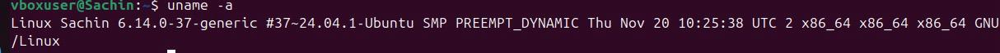

# Week 1 – System Introduction

In Week 1, I explored the basic commands and configurations of the Ubuntu system installed on VirtualBox.

## Tasks Performed:
- Checked system information using `uname -a`
- Displayed memory usage using `free -h`
- Retrieved IP address and network info using `ip addr`
- Verified OS version with `lsb_release -a`
- Checked disk space with `df -h`

## Commands Used and Outputs

```bash
uname -a
```


```bash
free -h
```


```bash
ip addr
```


```bash
lsb_release -a
```


```bash
df -h
```

