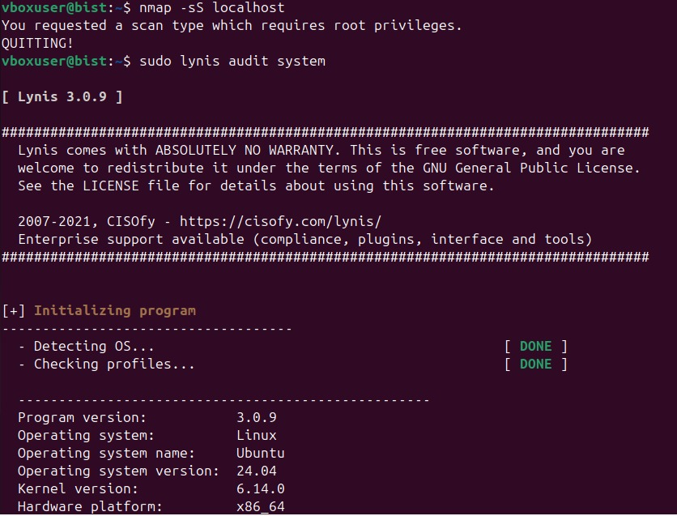
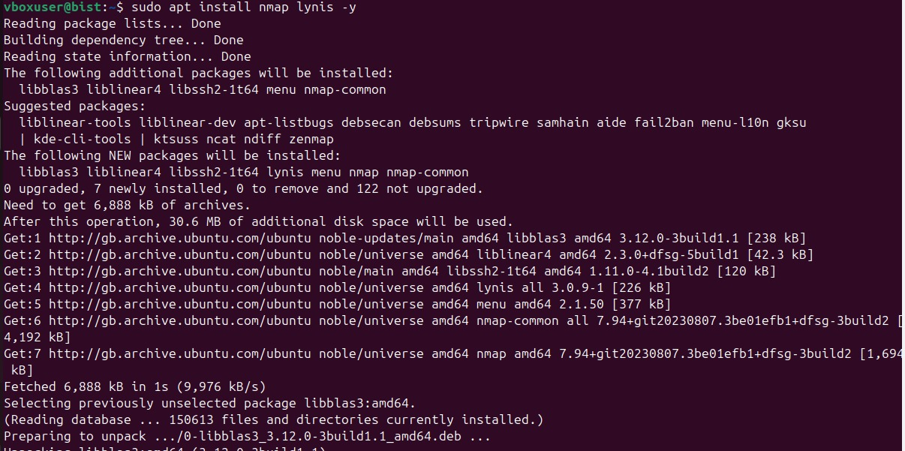

# Week 7 – Summary & Reflection

In the final week, I reflected on all tasks performed and summarized the outcomes.

## Summary
- Gained familiarity with Linux commands and system tools
- Learned performance benchmarking
- Improved understanding of OS-level tools

## Screenshot

